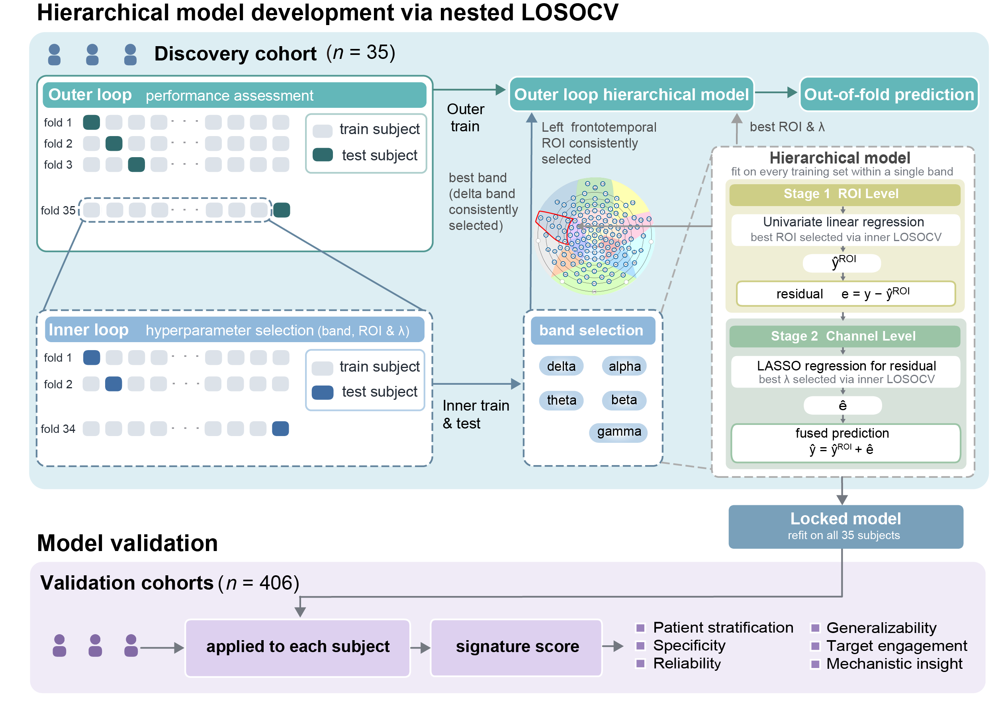

# Hierarchical-ML-Model

MATLAB code for the **nested-LOSOCV hierarchical model** used to derive a
resting-state EEG signature that predicts response to **accelerated continuous
theta-burst stimulation (acTBS)** in adolescent depression.

> Xiaoli Liu\*, Yan Liang\*, Wenwu Zhang\*, Wenlong Wang\*, Siyi Zhu\*, Fang Cheng,
> Yiyun Gong, Xinyu Yang, Guangxue Li, Changzhou Hu, Hongyi Zhi, Junlin Liu,
> Jiangfeng Shi, Zhenzhen Zhu, Shasha Hu, Shujun Wang, Jun Fu,
> Dongsheng Zhou†, Wei Wu†.
> *A Machine-Learning-Based Electroencephalographic Signature Predicts and Tracks
> Response to Accelerated Continuous Theta-Burst Stimulation in Adolescent
> Depression.* (\* equal contribution, † corresponding authors)

---

## Model overview



The outcome is the **percentage improvement in HAMD** after treatment
(`pctHAMD`). The signature is built from two levels of resting-state EEG
features, and every hyper-parameter is chosen inside a **nested
leave-one-subject-out cross-validation (LOSOCV)**, so each subject's prediction
is genuinely out-of-fold.

**Outer loop (performance assessment).** Leave one subject out and produce one
honest out-of-fold prediction per subject.

**Inner loop (hyper-parameter selection, on the outer-training subjects only).**

| Level | What it does | Selection rule |
|-------|--------------|----------------|
| **Band** | frequency band as top-level hyper-parameter (δ, θ, α, β, γ) | fused inner-LOSO MSE |
| **Stage 1 — ROI level** | univariate linear regression `ŷ_ROI = b₀ + b₁·ROI` on the single best ROI | inner-LOSO ROI-only MSE |
| **Stage 2 — Channel level** | LASSO on the channel features to fit the ROI residual `e = y − ŷ_ROI` | inner-LOSO fused MSE over a λ grid |
| **Fused prediction** | `ŷ = ŷ_ROI + ê` | — |

After the outer loop, the same procedure is re-run on the **full cohort** to
give the final signature: the selected band, ROI, univariate ROI regression and
the channel-level LASSO weights.

On the full discovery cohort (N = 35) the pipeline yields **Pearson r = 0.657**
between out-of-fold predictions and true `pctHAMD`, with the δ band and a left
temporal ROI consistently selected.

---

## Requirements

- MATLAB (tested on **R2022b**) with the **Statistics and Machine Learning
  Toolbox** (`lasso`, `corr`, `tinv`).

## Quick start

```matlab
% from the repository root, in MATLAB
run_example
```

This trains the model on the shipped 10-subject example cohort, prints the
internal nested-LOSO metrics, and writes results to `example_output/`
(per-fold prediction table, channel-stability table, and a scatter plot).

> **Note.** The 10-subject example is a de-identified **smoke test** so the code
> runs in seconds; it is *not* expected to reproduce the paper's `r = 0.657`,
> which requires the full N = 35 discovery cohort.

---

## Repository layout

```
Hierarchical-EEG-Signature/
├── run_example.m                     % end-to-end example driver
├── src/
│   ├── train_hierarchical_model.m    % nested LOSOCV + final signature
│   ├── load_roi_cube.m               % load the ROI feature cube
│   ├── load_channel_cube.m           % load the channel feature cube
│   ├── normalize_subject_ids.m       % subject-ID handling
│   ├── normalize_string_keys.m       % robust name/ID matching
│   └── make_signature_scatter.m      % predicted-vs-true scatter figure
├── example_data/
│   ├── roi_feature_cube_example.mat      % 10 subjects × 17 ROIs × 10 features
│   └── channel_feature_cube_example.mat  % 10 subjects × 121 channels × 11 features
└── example_output/                   % created when you run the example
```

`train_hierarchical_model` is the whole model: the outer + inner loops, Stage 1
(ROI level) and Stage 2 (channel level), the internal nested-LOSO metrics, and
the final signature refit on all subjects. It returns a struct `OUT`; the main
fields are:

| field | meaning |
|-------|---------|
| `pred_fused` | out-of-fold fused prediction per subject |
| `r`, `perm_p`, `RMSE`, `NRMSE`, `MAE`, `R2` | internal nested-LOSO metrics |
| `per_fold` | per-fold selected band / ROI / λ / #channels |
| `channel_stability` | how often each channel was selected across folds |
| `final_model` | selected band, ROI, and channel weights (refit on all) |

---

## Data format

Each cohort is described by two MAT files. The **ROI** file holds a struct
`roi_data`; the **channel** file holds a struct `channel_data`.

`roi_data`
| field | size | meaning |
|-------|------|---------|
| `X_roi` | `nSub × nROI × nFeat` | ROI-level features |
| `subjIDs` | `nSub × 1` | subject identifiers |
| `roiNames` | `nROI × 1` | ROI names (e.g. `LefttemporalA`) |
| `featNames` | `nFeat × 1` | feature/band names (e.g. `Rel_Delta`) |
| `pctHAMD` | `nSub × 1` | outcome (percent HAMD reduction) |

`channel_data`
| field | size | meaning |
|-------|------|---------|
| `X_chan` | `nSub × nChan × nFeat` | channel-level features |
| `subjIDs` | `nSub × 1` | subject identifiers |
| `chanNames` | `nChan × 1` | channel names |
| `featNames` | `nFeat × 1` | feature/band names |
| `pctHAMD` | `nSub × 1` | outcome (percent HAMD reduction) |

Features here are absolute/relative band power (`Abs_*`, `Rel_*`) for delta,
theta, alpha, beta and gamma. By default the model searches the relative-power
bands (`Rel_Delta … Rel_Gamma`); this is configurable via `cfg.target_feats`.

### Configuration (`cfg` passed to `train_hierarchical_model`)

| field | default | meaning |
|-------|---------|---------|
| `target_feats` | `["Rel_Delta" … "Rel_Gamma"]` | candidate bands |
| `lambda_grid` | `logspace(-4, 1.5, 25)` | LASSO λ grid |
| `max_nonzero` | `10` | cap on selected channels |
| `n_perm` | `5000` | permutations for the r p-value |
| `rng_seed` | `222` | random seed |

---

## Data availability

Only the de-identified 10-subject example dataset (a subset of the discovery
cohort, with subject IDs relabeled `Sub01…Sub10`) is distributed here so that
the code can be run out of the box. The full datasets are available from the
corresponding authors on reasonable request, subject to the study's
data-sharing and ethics agreements.

## License

Released under the MIT License (see `LICENSE`).
